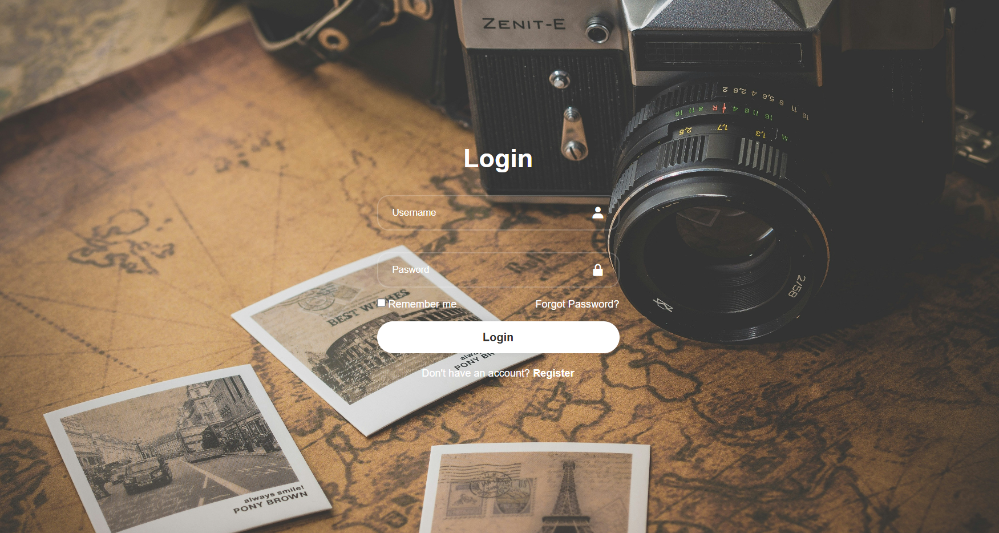

# Login

This is a login page study. I'm doing a piece of project I'll use on future. So, this project has:

- Box with username
- Box with password
- Check box to remmember your account
- Option of reset your password to do login again
- Login bottom
- Option to Register if you're new on platform

Follow a print screen of the page. On future, I'll use this simillar logic to do something amazing.

